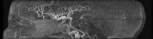

# Geometric modeling of blood vessels

  

## Introduction

Cardiovascular diseases are the leading cause of mortality worldwide, requiring accurate, non-invasive diagnostic methods. Magnetic resonance (MR) imaging is currently the premier technique, providing 3D visualization of blood in vessels and tissues without contrast agents or radiation. Despite its capabilities, clinical MR images consist of finite voxels (e.g., 0.5×0.5×0.5 mm³) with constant intensity values proportional to blood content. Blood vessel diameters range from centimeters (aorta) to micrometers (smaller vessels), often comparable to voxel dimensions. This results in "voxelization," where vessels appear as cuboid approximations with stair-like boundaries rather than natural smooth surfaces. Algorithms are needed to reconstruct true vessel morphology from these resolution-limited images for improved diagnosis. MR images also contain random intensity fluctuations, creating additional uncertainty in vessel centerline detection and diameter measurement. Modeling algorithms must be robust against these inherent distortions and noise. Comprehensive modeling must also account for vessels smaller than voxel dimensions, which aren't individually visible but contribute to overall blood perfusion effects.

The project is aimed at development of mathematical description of the structure of blood vessels visualized in 3D magnetic resonance images. Such models offer objective, accurate geometrical information on the blood vessel trees and parameters of their branches – for detailed, personalized diagnosis of the circulatory system. They can be used for noninvasive simulation of blood flow, e. g. in critical regions such as stenoses and aneurysms. Geometric modeling allows for construction of vascular prostheses, e. g. via 3D printing, to restore patency of diseased branches.

## Methods
Traditional blood vessel modeling first applies image segmentation (like intensity thresholding) to create a binary image at voxel intersection points. This approach is too sparse to accurately represent vessel walls between these points. It also ignores local wall shape, centerline paths, and intensity profiles around image points.
In this project, continuous (analog) models representing key MR image formation processes were used. Parametric models of these phenomena were defined and locally tuned to fit the spatial intensity distribution. This approach enabled quantitative evaluation of important blood vessel geometric properties in continuous space.

The blood vessel tree geometric modeling algorithm is shown in Fig. 1 (Materka 2015). The tree image undergoes multiscale Frangi "vesselness" filtering based on Hessian computation at each point. This filter enhances elongated vessel structures while suppressing background intensity. The filtered result is thresholded, and a skeleton of binary regions is extracted. In our method, segments between tree bifurcations are approximated by smooth differentiable functions of three spatial coordinates. This enables calculation of centerline tangent vectors and perpendicular planes (local cross-sections). Consequently, azimuth and elevation angles become resistant to random fluctuations and intensity jumps common in ToF images.
<table align="center">
  <tr><td align="center"></td></tr>
  <tr><td align="center"><i>Fig. 1 A geometric modeling algorithm for arteries (time of flight, ToF) and veins (quantitative susceptibility imaging, QSM) in MR techique</i></td></tr>
</table>

On the cross-section planes, an intensity profile model is fitted to take account of vessel edge blurring originating in MR signal averaging inside the voxel space and other effects, jointly representing the MR scanner “impulse response” or “point spread function”. The intensity profile along radial directions around the vessel centerline point (Fig. 2a) is continuous and given analytically (Materka 1991), (Materka 2015). The results of model fitting are local values of background intensity, intensity jump inside the vessel and the vessel radius.

Vessel segments between bifurcations are described by sets of centerline points, each attributed a tangent vector and radius, Fig. 3a. This description allows easy approximation of the surface of the vessel walls by a triangular mesh, Fig. 3b. By applying these steps to all the vascular tree segments of the skeleton, one obtains the whole geometric model of the macroscopic part of the artery (ToF) and vein (QSM) trees visualized in the images, Fig. 3c.

The reconstructed segments of the vessel tree are coupled together via dedicated T-junctions to model the bifurcations, Fig. 3d, developed with the use of computer graphics techniques (Kociński 2016), Vinhais 2018). The assumption of circular vessel branch shape can be easily relaxed to move the nodes of the triangular mesh to the actual vessel tree surface, with a small number of iterative refinements (Vinhais 2018).
