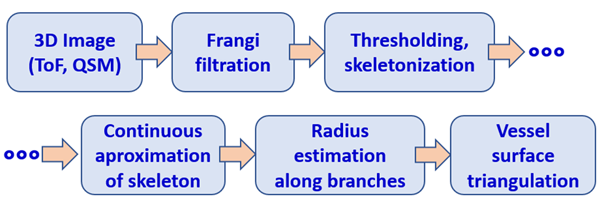
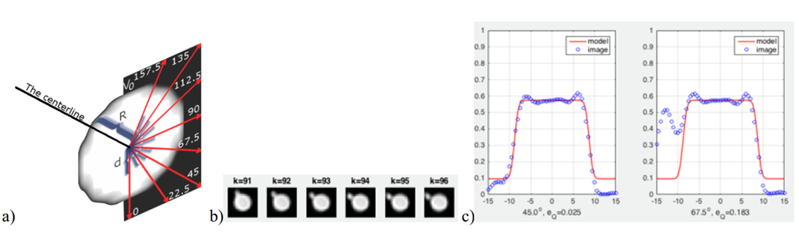
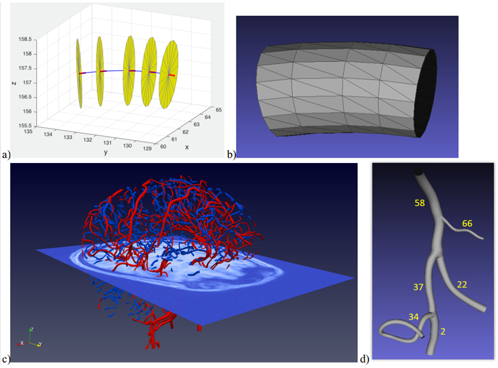
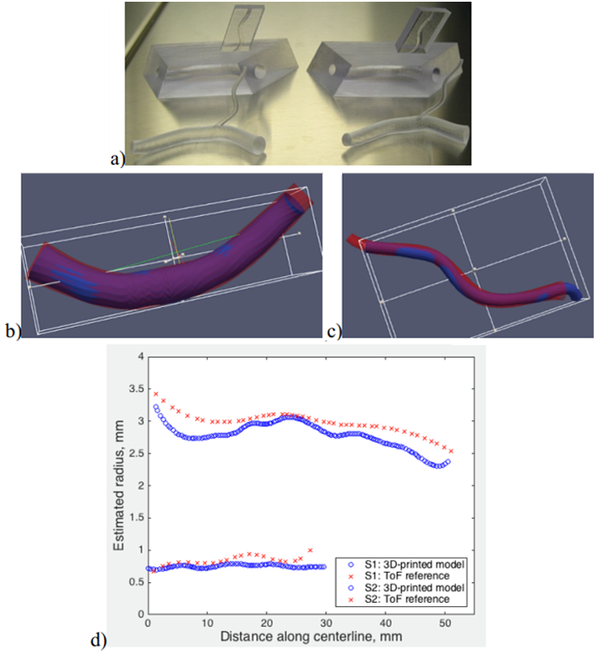
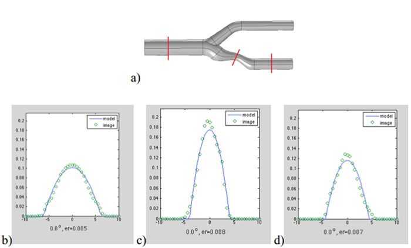
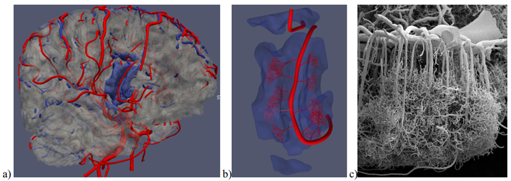

# Geometric modeling of blood vessels

  

## Introduction

Cardiovascular diseases are the leading cause of mortality worldwide, requiring accurate, non-invasive diagnostic methods. Magnetic resonance (MR) imaging is currently the premier technique, providing 3D visualization of blood in vessels and tissues without contrast agents or radiation. Despite its capabilities, clinical MR images consist of finite voxels (e.g., 0.5×0.5×0.5 mm³) with constant intensity values proportional to blood content. Blood vessel diameters range from centimeters (aorta) to micrometers (smaller vessels), often comparable to voxel dimensions. This results in "voxelization," where vessels appear as cuboid approximations with stair-like boundaries rather than natural smooth surfaces. Algorithms are needed to reconstruct true vessel morphology from these resolution-limited images for improved diagnosis. MR images also contain random intensity fluctuations, creating additional uncertainty in vessel centerline detection and diameter measurement. Modeling algorithms must be robust against these inherent distortions and noise. Comprehensive modeling must also account for vessels smaller than voxel dimensions, which aren't individually visible but contribute to overall blood perfusion effects.

The project is aimed at development of mathematical description of the structure of blood vessels visualized in 3D magnetic resonance images. Such models offer objective, accurate geometrical information on the blood vessel trees and parameters of their branches – for detailed, personalized diagnosis of the circulatory system. They can be used for noninvasive simulation of blood flow, e. g. in critical regions such as stenoses and aneurysms. Geometric modeling allows for construction of vascular prostheses, e. g. via 3D printing, to restore patency of diseased branches.

## Methods
Traditional blood vessel modeling first applies image segmentation (like intensity thresholding) to create a binary image at voxel intersection points. This approach is too sparse to accurately represent vessel walls between these points. It also ignores local wall shape, centerline paths, and intensity profiles around image points.
In this project, continuous (analog) models representing key MR image formation processes were used. Parametric models of these phenomena were defined and locally tuned to fit the spatial intensity distribution. This approach enabled quantitative evaluation of important blood vessel geometric properties in continuous space.

The blood vessel tree geometric modeling algorithm is shown in Fig. 1 (Materka 2015). The tree image undergoes multiscale Frangi "vesselness" filtering based on Hessian computation at each point. This filter enhances elongated vessel structures while suppressing background intensity. The filtered result is thresholded, and a skeleton of binary regions is extracted. In our method, segments between tree bifurcations are approximated by smooth differentiable functions of three spatial coordinates. This enables calculation of centerline tangent vectors and perpendicular planes (local cross-sections). Consequently, azimuth and elevation angles become resistant to random fluctuations and intensity jumps common in ToF images.
 
<table align="center">
  <tr><td align="center"></td></tr>
  <tr><td align="center"><i>Fig. 1 A geometric modeling algorithm for arteries (time of flight, ToF) and veins (quantitative susceptibility imaging, QSM) in MR techique</i></td></tr>
</table>
 
On cross-section planes, an intensity profile model is fitted to account for vessel edge blurring caused by MR signal averaging within voxels and other effects, collectively representing the MR scanner's "impulse response" or "point spread function." The intensity profile along radial directions from the vessel centerline point (Fig. 2a) is continuous and analytically defined (Materka 1991, 2015). Model fitting yields local values of background intensity, vessel interior intensity jump, and vessel radius.
 
<table align="center">
  <tr><td align="center"></td></tr>
  <tr><td align="center"><i>Fig. 2 a) Radial directions on a vessel cross-section plane for intensity profile fitting, b) example of consicutive cross-sections of a vessel featuring thin bifurcating branch, c) results of fitting the profile along 45&deg; and 67.5&deg; directions</i></td></tr>
</table>
 
Vessel segments between bifurcations are represented by sets of centerline points, each with an associated tangent vector and radius (Fig.&nbsp;3a). This description facilitates approximation of vessel wall surfaces using triangular meshes (Fig. 3b). Applying these steps to all vascular tree segments in the skeleton produces a complete geometric model of the macroscopic portions of artery (ToF) and vein (QSM) trees visualized in the images (Fig. 3c).
 
<table align="center">
  <tr><td align="center"></td></tr>
  <tr><td align="center"><i>Fig. 3 Illustration of the  the elements of the vessel segment model (centerline in blue, tangent vectors in red, circular cross-sections in yellow), b) triangular mesh modeling the inner walls of the segment, c) arterial tree branches extracted from brain ToF image (in red) and venous branches from QSM (in blue), d) geometric model of example branches together with a "waterpfoof" T-junctions (bifurcations). </i></td></tr>
</table>
 
The reconstructed segments of the vessel tree are coupled together via dedicated T-junctions to model the bifurcations, Fig. 3d, developed with the use of computer graphics techniques (Kociński 2016), Vinhais 2018). The assumption of circular vessel branch shape can be easily relaxed to move the nodes of the triangular mesh to the actual vessel tree surface, with a small number of iterative refinements (Vinhais 2018).

## Results
The developed geometric models are "waterproof," enabling creation of physical vessel tree models (e.g., plastic phantoms) compatible with MR scanners. Such phantoms were designed based on selected arterial branches from a real brain and manufactured using a 3D printer (Fig. 4a, Kociński 2017a). These printed phantoms were submerged in water and placed in a clinical MR scanner to acquire typical low-resolution T2-weighted images. After image preprocessing, the algorithm from Fig. 1 was applied. The resulting geometric model of connected branches was compared with the original (Fig. 4b-d), showing excellent agreement in branch shape and vessel radius.
 
<table align="center">
  <tr><td align="center"></td></tr>
  <tr><td align="center"><i>Fig. 4 a) A photography of a few 3D printed phantom manufactured on the basis of the model of real vessel extracted from a ToF image, b) wall surface of the thicker branch, c) the surface of the thinner branch, d) radius estimated along the centerline (red - model extracted from brain ToF image, blue - 3D 
 printed model).</i></td></tr>
</table>
 
In Klepaczko (2015), an MR scanner computer simulator (Klepaczko 2014) was used to generate phase contrast angiography (PCA) images of a carotid artery geometric phantom (Fig. 5a). PCA image intensity approximates the magnitude of blood cells' local velocity vector. A parabolic function was used as the fitted intensity profile model, assuming laminar flow.
 
<table align="center">
  <tr><td align="center"></td></tr>
  <tr><td align="center"><i>Fig. 5 a) Visualization of a digital phantom of cartoid artery with stenosis, b),c),d) blood velocity profile fitted to cross-sections marked in red on a), from left to right.</i></td></tr>
</table>
 
A computer program was developed to adapt the Karch algorithm for simulating vessel tree growth at the mesoscopic scale (arterioles and venules). These simulated trees were connected to macroscopic-scale branches to model blood supply to adjacent cortex regions (Fig. 6b). The cortex (gray matter) surface was approximated using a triangular mesh derived from a segmented T2-weighted image from the same subject (Fig. 6a).
 
<table align="center">
  <tr><td align="center"></td></tr>
  <tr><td align="center"><i>Fig. 6 a) Model of arterial (in red) and venous (in blue) branches superimposed on the surface of brain gray matter (in gray), b) selected region of brain cortex (light blue) connected via Karch-algorithm-synthesized thin arteriole trees with an artery located within the region fissure, c) A photomicrograph of corrosive model of microscopic brain blood vessels (A. Rodriges-Baeza and M. Ortega-Sanchez, Portrets of the Mind, 2010, pp. 216-217, reproduced with kind permission of the authors).</i></td></tr>
</table>
 

## Conclusions
Thanks to approximation of a number of consecutive vessel skeleton points with a differentiable function, the estimation of centerline tangent vectors, and thus the definition of perpendicular cross-sections, is much more accurate than in the case of original Frangi method (Blumenfeld 2015), (Materka 2015).

The use of analytical continuous model of image blur allows estimation of the vessel diameter with the accuracy greater than the voxel sides (subvoxel accuracy). The plot shown in Fig. 4d was obtained for 0,5x0,5x0,5 mm3 voxel-size ToF image for the arteries and 0,33x0,33x2,2 mm3 voxel-size T2 image for the plastic phantom.

Local fitting of the image blur model in each skeleton point makes the radius estimation practically insensitive to image intensity and contrast nonuniformities (Blumenfeld 2015), (Materka 2015).

The computation time needed for fitting the models for all macro-scale brain vessels (Fig. 3c) is about 15 minutes (Intel i7, 16 GB, 2.2 GHz). The algorithm runs automatically – there is no need for manual marking of the vessel endpoints. However, binarization still puts a limits on accuracy of geometric modeling, and the implicit spatial function of their walls surface does not provide information about the vessel tree structure and topological relations between its branches.

The developed model of intensity profile inside vessels can have a form different to the one shown in Fig. 2c, adequately to physical phenomena that take place in the process of image formation. A parabolic-function model, fitted to PCA images serves estimation of the local radius and, at the same time, the blood velocity distribution inside the vessel lumen, Fig. 5.  They were confirmed with the use of real-life PCA MRI of physical radiological phantoms under the controlled flow of a liquid with haemodynamic properties resembling the blood (Klepaczko 2014), (Materka 2015).

AS illustrated in Fig. 6a, location of arteries and brain cortex surface can be reconstructed with high accuracy, respectively from ToF and T2-weighted images. This accuracy allows specification of the geometric conditions for the growth of arteriole trees. For the algorithmic connection of both trees (Fig. 6b), literature data were used (average blood pressure in capillaries, average radius of thin vessels in the cortex). Visually, one can confirm similarity of the connected macro- and mesoscale models to the microphotography of real-life vessels, Fig. 6c. Full, personalized control of the growth of arteriole trees requires additional, locally averaged image information on perfusion and matter exchange in tissues. This information was not available at the time of the project realization; it is likely it will be in future, as the result of progress in MR imaging.

They are realistic possibilities of further improvements in the modeling method and increase of its accuracy, with the use of deep learning algorithms (Jurek 2020).

--- 
## Related projects
   - [3D image texture analysis of simulated and real-world vascular trees](https://github.com/marekkoc/vascular-tree-3D-texture-analysis)
   - [Assessment of brain tumor vascularizaton](https://github.com/marekkoc/brain-tumor-vascularization/tree/main)
   - Numerical modeling of the cerebral arterial and venous blood-vessel system in macro-and meso-scale based on 3D MRI data
   - Validation of blood vessel segmentation algorithms
   - Exhange model between blood vessel and surrounding tissue
   - "MRI simulator" of computer simulated vascular trees
   - Computer simulation of vascular tree growth and blood flow simulation through porus tissue   

---
## Publication

1. (Blumenfeld 2015) J. Blumenfeld, M. Kociński, A. Materka, A centerline-based algorithm for estimation of blood vessels radii from 3D raster images, IEEE Signal Processing, Algorithms, Arrangements and Applications (SPA), 2015, pp. 38-43, Poznań, ([link](https://doi.org/10.1109/SPA.2015.7365110)).
1. (Jurek 2020) J. Jurek, M. Kociński, A. Materka, M. Elgalal, A. Majos, CNN-based superresolution reconstruction of 3D MR images using thick-slice scans, Biocybernetics and Biomedical Engineering 40(1), 2020, pp. 111-125, ([link](https://doi.org/10.1016/j.bbe.2019.10.003)).
1. (Klepaczko 2014) A. Klepaczko, P. M. Szczypiński, G. Dwojakowski, M. Strzelecki, A. Materka, Computer Simulation of Magnetic Resonance Angiography Imaging: Model Description and Validation, PLOS ONE 9(4):e93689 , 2014, pp. 1-15, ([link](https://doi.org/10.1371/journal.pone.0093689)).
1. (Klepaczko 2015) A. Klepaczko, A. Materka, P. M. Szczypiński, M. Strzelecki, Numerical Modeling of MR Angiography for Quantitative Validation of Image-Driven Assessment of Carotid Stenosis, IEEE Transactions on Nuclear Science 62(3), 2015, pp. 619-627, ([link](https://doi.org/10.1109/TNS.2015.2433925)).
1. (Klepaczko 2016) A. Klepaczko, P. M. Szczypiński, A. Deistung, J. R. Reichenbach, A. Materka, Simulation of MR angiography imaging for validation of cerebral arteries segmentation algorithms, Computer Methods and Programs in Biomedicine 137, 2016, pp. 619-627, ([link](http://dx.doi.org/10.1016/j.cmpb.2016.09.020)).
1. (Kociński 2016) M. Kociński, A. Materka, A. Deistung, J. R. Reichenbach, Centerline-based surface modeling of blood-vessel trees in cerebral 3D MRA, IEEE Signal Processing Algorithms, Architectures, Arrangements, and Applications - SPA 2016, pp. 85-90, Poznań, ([link](https://doi.org/10.1109/SPA.2016.7763592)).
1. (Kociński 2017a) M. Kociński, A. Materka, M. Elgalal, A. Majos, On accuracy of personalized 3D-printed MRI-based models of brain arteries, 2017 International Conference on Systems, Signals and Image Processing (IWSSIP), Poznań, ([link](https://doi.org/10.1109/IWSSIP.2017.7965601)).
 1. (Kociński 2017b) M. Kociński, A. Materka, A. Deistung, J. R. Reichenbach, A. Lundervold, Towards multi-scale personalized modeling of brain vasculature based on magnetic resonance image processing, IEEE 24th International Conference on Systems, Signals and Image Processing, Poznań, ([link](https://doi.org/10.1109/IWSSIP.2017.7965604)).
1. (Materka 1991) A. Materka, Metody pomiaru wybranych cech geometrycznych sceny 3W, w Elementy cyfrowego przetwarzania i analizy obrazów, A. Materka (Ed.), Ch. 2., PWN 1991, ([link](https://www.researchgate.net/publication/301326880_Elementy_cyfrowego_przetwarzania_i_analizy_obrazow)), ISBN 83-01-10566-6,
1. (Materka 2015) A. Materka, M. Kociński, J. Blumenfeld, A. Deistung, B. Serres, J. R. Reichenbach, Automated Modeling of Tubular Blood Vessels in 3D MR Angiography Images, 9th International Symposium on Image and Signal Processing and Analysis (ISPA 2015), pp. 56-61, Zagreb, ([link](https://doi.org/10.1109/ISPA.2015.7306032)).
1. (Vinhais 2018) C. Vinhais, M. Kociński, A. Materka, Centerline-Radius Polygonal-Mesh Modeling of Bifurcated Blood Vessels in 3D Images using Conformal Mapping, 2018 Signal Processing: Algorithms, Architectures, Arrangements, and Applications (SPA), Poznań, ([link](https://doi.org/10.23919/SPA.2018.8563388)).
1. (Woźniak 2017) T. Woźniak, M. Strzelecki, A. Majos, L. Stefańczyk, 3D vascular tree segmentation using a multiscale vesselness function and a level set approach, Biocybernetics and Biomedical Engineering 37, 2017, pp. 66-77, ([link](https://doi.org/10.1016/j.bbe.2016.11.003)).

--- 
## Project Information

The project was carried out from 2003 to 2019 at the [Institute of Electronics](https://ie.p.lodz.pl/en/about-institute-electronics), [Lodz University of Technology](https://p.lodz.pl/en), headed by [Prof. Andrzej Materka](https://p.lodz.pl/en/research/most-prominent-scientists/professor-andrzej-materka), in close partnership with [Friedrich Schiller University Jena](https://www.uni-jena.de/en) led by [Prof. Dr. Jürgen Reichenbach](https://www.mscj.uni-jena.de/staff/prof-dr-jurgen-reichenbach/) and the [University of Bergen](https://www.uib.no/en) with consultations from [Prof. Arvid Lundervold](https://www4.uib.no/en/find-employees/Arvid.Lundervold).
